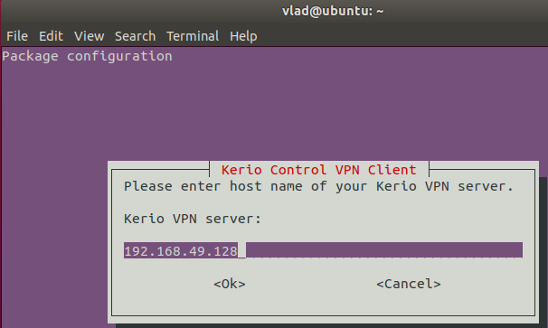
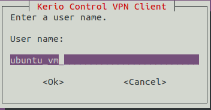
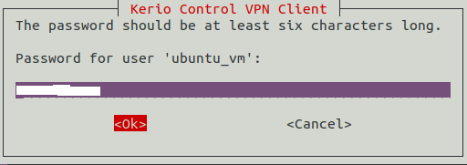
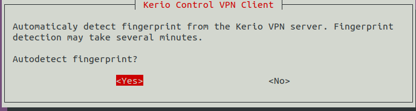
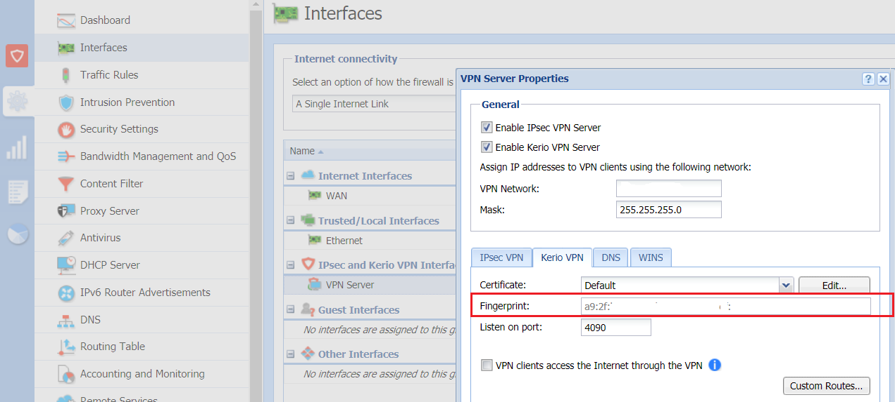
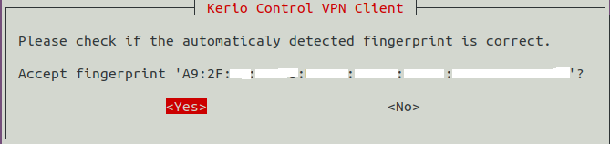
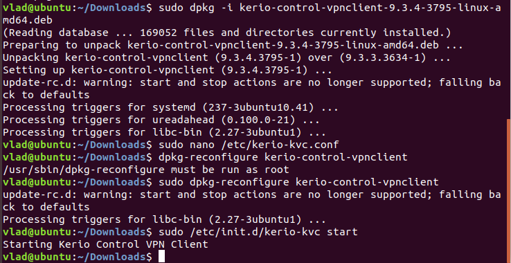
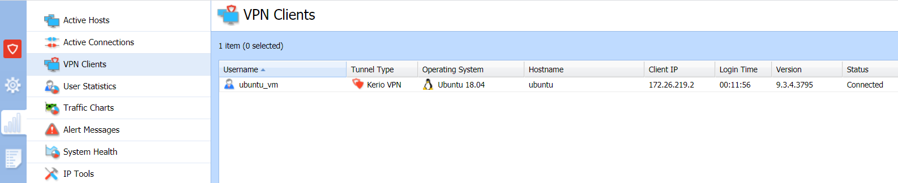
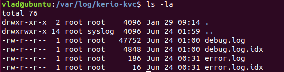

# Установка Kerio Control VPN Client на Linux

## Обзор
Kerio Control VPN Client — инструмент для безопасного подключения к приватной сети через шлюз Kerio Control.
Этот гайд показывает, как установить и настроить клиент на Debian / Ubuntu Linux.

---

## Предварительные требования
- Дистрибутив: **Debian / Ubuntu**
- Установлены пакеты `debconf` и `openssl`

```bash
sudo apt-get install debconf openssl
```

---

## Установка

### Скачивание клиента

Скачать Kerio Control VPN Client можно с официального сайта:
[http://download.kerio.com/archive/download.php](http://download.kerio.com/archive/download.php)

### Для 32-битной системы
```bash
sudo dpkg -i kerio-control-vpnclient-###-linux.deb
```

### Для 64-битной системы
```bash
sudo dpkg -i kerio-control-vpnclient-###-linux-amd64.deb
```

> **Примечание:** после установки клиент не появится в графическом меню приложений. Управление и настройка выполняются только через CLI.

При установке запускается мастер конфигурации, где указываются:

### 1. Адрес/имя сервера
При нестандартном порте добавляйте его: `server1:4091`



### 2. Имя пользователя



### 3. Пароль



### 4. Отпечаток сертификата (автоматически или вручную)



---

## Конфигурация  

Клиент поддерживает только одно VPN-соединение одновременно.  

### Изменение параметров
```bash
sudo dpkg-reconfigure kerio-control-vpnclient
```

### Ручное редактирование
```bash
sudo nano /etc/kerio-kvc.conf
```

После правок:
```bash
sudo /etc/init.d/kerio-kvc reload
```

---

## Проверка отпечатка сертификата

1. В консоли администратора Kerio Control открыть **Configuration → Interfaces**
2. Зайти в свойства VPN-сервера
3. Сравнить отпечаток (Fingerprint) с тем, что предложил клиент



4. Подтвердить fingerprint в клиенте



---

## Управление клиентом  

- Клиент стартует автоматически при установке  
- После конфигурации перезапускается  

### Ручное управление

Запуск
```bash
sudo /etc/init.d/kerio-kvc start
```
---
Остановка
```bash
sudo /etc/init.d/kerio-kvc stop
```
---
Перезапуск
```bash
sudo /etc/init.d/kerio-kvc restart
```
---

Примеры команд установки, конфигурации и запуска:


---

При активном подключении в **Status → VPN clients** статус будет: **Connected**



---

## Удаление

Удалить пакет, оставив конфигурацию:
```bash
sudo apt-get remove kerio-control-vpnclient
```

Удалить полностью с конфигурацией:
```bash
sudo apt-get remove --purge kerio-control-vpnclient
```

---

## Лог-файлы

Клиент сохраняет логи в `/var/log/kerio-kvc`:

- `init.log` — запуск/остановка демона
- `error.log` — критические ошибки
- `debug.log` — подробная отладка



---

## Дополнительно

- Библиотека `libkvnet` распространяется под лицензией **LGPL**
- Исходники модуля `kvnet` доступны в архиве open source от Kerio
- См. также:
  - Installing and Configuring Kerio Control VPN Client on Windows
  - Configuring Kerio Control VPN Client in OS X

---
